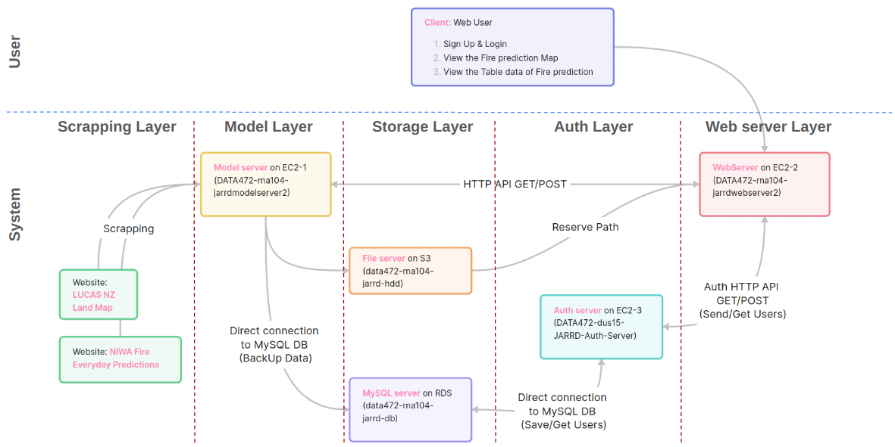

# `Fire Predictions in Christchurch` Group Project for DATA472 course at the University of Canterbury

## Contributors

1. **Jess** - developer of the model
2. **Anirudh** - developer of the website
3. **Roman** - creation of EC2s, DB and tables in it, S3 and integration via api ModelServer, WebServer, S3 and RDS together
4. **Ruben** - developer of the scrapper
5. **Dimitrii** - developer of the authorization part, integration Auth and Web servers.

All of contributors participated in continuous generation and improvement of the idea of the project, develop documentation etc.

## Presentation

The presentation of our group project is available in the folder "Presentation"

## Deploy overall system into Amazon Cloud (AWS)

The pipeline how to deploy overall system into Amazon Cloud (AWS) was described in Readme files in corresponding folders:

**Model server:** [Model server](./src/iFireTrackerModel/README.md)

**Web server:** [Web server](./src/iFireTrackerWeb/README.md)

**Authorization server:** [Auth server](./src/auth/README.md)

The overall architecture of our system you can see in the presentation ("Presentation" folder) and below as well

## Communication

All communication was via WhatsApp messenger in a group chat. Discussed all changes about the project, statuses, what should we do, etc.

## Conclusion

The entire Fire Prediction project was developed from scratch (from idea to implementation) within weeks of the DATA472 course and fully deployed on AWS. The system consists of many objects, such as the Web, Model and Authentication servers, Database and File storage:

1. **Flask, Gunicorn and Nginx** were used for Web server. 
2. **Boto3 and MySQL connector** libraries were used for Storages. 
3. **Folium** was used for map generating in Model server. 
4. **Selenium** library was used for source websites scrapping. 

If you have any questions, please feel free to ask us.