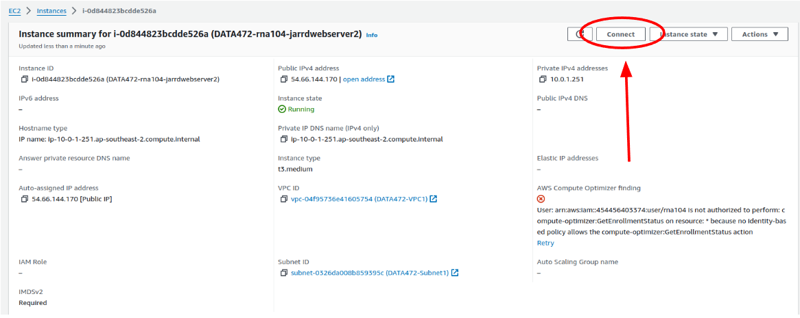
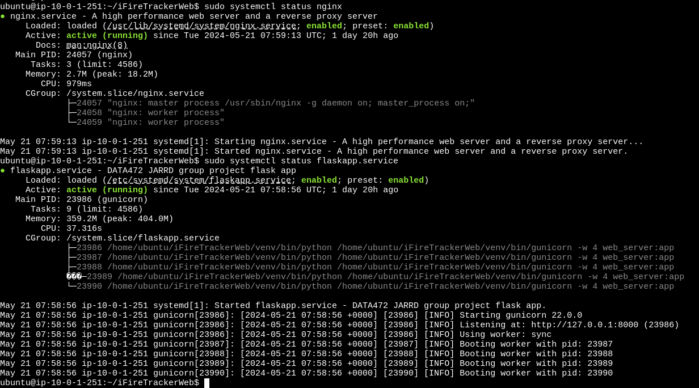

# `Fire Predictions in Christchurch` Group Project for DATA472 course at the University of Canterbury

## The general architecture of our system

The overall architecture of our system you can see in the presentation ("Presentation" folder) and below as well


## The pipeline how to deploy web server environment and web application into Amazon Cloud (AWS) is below


### 1. Clone this repository into your folder on local machine

```
cd PATH-YOUR-LOCAL-DIRECTORY
git clone https://github.com/UC-JARRD/iFireTracker.git
```

### 2. Create a AWS EC2 for WebServer instance

Follow the instructions from Paul Benden, access on LEARN (University of Canterbury internal page, only for students) in the AWS Resources chapter of this course.   

Additionally, basic information how to create and tune your EC2 instance you can find on the official AWS website here: https://docs.aws.amazon.com/AWSEC2/latest/UserGuide/EC2_GetStarted.html


### 3. AWS setup on EC2 (WebServer)

1. To work with EC2 instance you should connect to this virtual environment. You can do it using `ssh` or just use AWS web interface to click the `Connect` button on the top right corner of EC2 instance page and select the tab `EC2 Instance Connect` by default, you will be able to connect to the instance without any further setup.



1. Copy the local folder on your machine to EC2 home directory running the command below on your local machine in terminal

```
cd <PATH-YOUR-LOCAL-DIRECTORY>iFireTracker
scp -i <PATH-TO-YOUR-PEM-KEY-ON-LOCAL-MACHINE> -r iFireTrackerWeb ubuntu@<EC2-PUBLIC-IP-ADDRESS>:/home/ubuntu/
```


### 4. Setup Flask app environment on EC2 (WebServer)

1. Using bash on EC2 create the `venv` folder in the `iFireTrackerWeb` folder and activate this environment using the following commands:
2. Enter to the folder `iFireTrackerWeb` using the command `cd iFireTrackerWeb`

```bash
sudo apt-get update
sudo apt install python3-virtualenv
virtualenv -p python3 venv
source venv/bin/activate
```

3. Install the required packages using the command: 

```bash
pip install requirements.txt
```

4. Finally, your app folder should be like the following:

```
iFireTrackerWeb/
├────────── data/
│             ├── csv/
│             │    └── fire_risk_per_land_use_area.csv
│             └── html/
│                  └── fire_risk_map.html
├────────── flaskapp.service
├────────── get_files_from_s3.py
├────────── requirements.txt
├────────── static/
│             └── images/
│                  └── background.jpg
├────────── templates/
│             ├── csv.html
│             ├── login.html
│             ├── main.html
│             ├── registration.html
├────────── venv/
│             ├── bin/
│             ├── lib/
│             └── pyvenv.cfg
└────────── web_server.py
```


### 5. Setup Gunicorn environment on EC2

1. Copy a `flaskapp.service` file from `iFireTrackerWeb` to the `/etc/systemd/system/` folder using the command 

```bash
sudo mv flaskapp.service /etc/systemd/system/
```

Note: If your EC2 instance image is not ubuntu, you should replace the `ubuntu` with the correct user name in the `flaskapp.service` file.

2. Enable the service by running the following command:

```bash
sudo systemctl start flaskapp
sudo systemctl enable flaskapp
```

### 6. Setup Nginx environment on EC2 

1. Install nginx by running the following command:

```bash
sudo apt-get update
sudo apt-get install nginx
```

2. Start Nginx:

```bash
sudo systemctl start nginx
```

3. Enable Nginx reverse proxy by updating a file named `default` in the `/etc/nginx/sites-available/` folder. You should replace the IP address in the file with your `EC2-PUBLIC-IP-ADDRESS` IP address.

```bash
server {
        listen 80 default_server;
        listen [::]:80 default_server;

        root /var/www/html;
        index index.html index.htm index.nginx-debian.html;

        server_name <EC2-PUBLIC-IP-ADDRESS>;

        location / {
                proxy_pass         http://127.0.0.1:8000/;
                proxy_redirect     off;

                proxy_set_header   Host                 $host;
                proxy_set_header   X-Real-IP            $remote_addr;
                proxy_set_header   X-Forwarded-For      $proxy_add_x_forwarded_for;
                proxy_set_header   X-Forwarded-Proto    $scheme;
        }
}
```

4. Restart Nginx by running the following command:

```bash
sudo systemctl restart nginx
```



Now the web application will be available at the EC2 public IP address from the browser. `http://<EC2-PUBLIC-IP-ADDRESS>`


## Conclusion

This Web server  is one of the part of our group prototype at the DATA472 course. Another parts of full Fire Prediction Project include Model Server, Authorization server, S3 file storage and MySQL database on AWS RDS. The whole Fire Prediction project was developed from scratch (from idea to implementation) within course weeks. If you have any questions, please feel free to ask us.